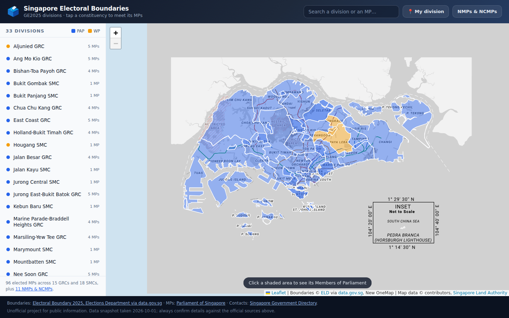

# Singapore Electoral Boundaries & Your MPs

An interactive map of Singapore's **GE2025 electoral divisions**. Click any constituency to
open a modal listing every Member of Parliament who serves it — with their photograph, the
offices they hold, their contact details and their Meet-the-People Session times.

**▶ Live site: https://rayray39.github.io/sg-electoral-boundaries/**



## What it shows

- **33 electoral divisions** — 15 GRCs and 18 SMCs — drawn from the official 2025 boundary data,
  shaded by the party holding the seat.
- **Click a division** → a modal with one card per MP: full name, party, terms served, photograph,
  every current office-holding role (e.g. *Minister for National Development*), past appointments,
  email, phone/WhatsApp, Meet-the-People Session venue and timing, and links to their social
  accounts and Parliament profile.
- **Search** for a division or an MP by name, constituency or ministerial role.
- **"My division"** uses your browser location and a point-in-polygon test to find the
  constituency you are standing in.
- **NMPs & NCMPs** — the 11 members who sit in Parliament without a geographic constituency.

96 elected MPs + 9 Nominated MPs + 2 Non-Constituency MPs = 107 members, all present.

## Data sources

| Data | Source |
| --- | --- |
| Electoral division boundaries (GeoJSON) | [Electoral Boundary 2025](https://data.gov.sg/datasets?formats=GEOJSON&sort=relevancy&query=electoral+boundary&resultId=d_7ddf956dfc1c59080bf95bba1c58a5d2), Elections Department via data.gov.sg |
| MP names, photos, roles, Meet-the-People Sessions | [Parliament of Singapore](https://www.parliament.gov.sg/mps/list-of-current-mps) |
| Official emails and phone numbers | [Singapore Government Directory](https://www.sgdi.gov.sg/organs-of-state/parl) |
| Basemap | [OneMap](https://www.onemap.gov.sg/), Singapore Land Authority |

### A note on WhatsApp numbers

Singapore MPs do not publish personal WhatsApp numbers, so none exist to show. Where the
Government Directory lists a contact line for an MP, the site renders it as a `wa.me` link
(many constituency offices do accept WhatsApp on it) alongside a plain `tel:` link — labelled
explicitly as *"publicly listed office line — not a personal number"*. For the MPs with no
listed number, the card says so rather than inventing one. To actually reach an MP, the
Meet-the-People Session details on each card are the channel they themselves publish.

## How it is built

There is no framework and no build step for the site itself — `docs/` is plain HTML, CSS and
one JavaScript file, with [Leaflet](https://leafletjs.com/) from a CDN. GitHub Pages serves
`docs/` directly.

Two Python scripts prepare the data:

```
scripts/scrape_mps.py       parliament.gov.sg + sgdi.gov.sg  ->  data/mps.json
scripts/build_site_data.py  data/*  ->  docs/data/*  +  docs/assets/mp/*.jpg
```

`build_site_data.py` joins MPs to divisions on the normalised constituency name, sorts each
division's members so office-holders appear first, trims coordinate precision, and downsizes
every mugshot to a 360 px JPEG (the raw portraits total ~100 MB; the mirrored set is ~2 MB).

### Refreshing the data

```bash
pip install Pillow
python3 scripts/scrape_mps.py                       # re-scrape MPs
BUILD_DATE=$(date -u +%F) python3 scripts/build_site_data.py
```

Delete `docs/assets/mp/` first if you want photographs re-fetched; existing files are kept.
To pick up new boundaries, re-download the GeoJSON:

```bash
curl -s "https://api-open.data.gov.sg/v1/public/api/datasets/d_7ddf956dfc1c59080bf95bba1c58a5d2/poll-download" \
  | python3 -c "import sys,json;print(json.load(sys.stdin)['data']['url'])" \
  | xargs curl -s -o data/electoral_boundary_2025.geojson
```

### Running locally

```bash
python3 -m http.server 8777 --directory docs
# open http://localhost:8777
```

## Repository layout

```
docs/                 the published site (GitHub Pages source)
  index.html
  styles.css
  app.js              map, search, geolocation, modal rendering
  data/               divisions.geojson, mps.json  (generated)
  assets/mp/          mugshots                     (generated)
data/                 raw scraped data
scripts/              scrapers and the data build
```

## Disclaimer

An unofficial project, built for public information. The data is a snapshot — Cabinet
appointments and Meet-the-People arrangements change. Always confirm against the official
sources linked above and in the site footer. Photographs and contact details remain the
property of their respective owners and are reproduced here for public-interest reference.

## Licence

Code is MIT (see [LICENSE](LICENSE)). The underlying data is published by Singapore government
agencies under their own terms — boundary data via the
[Singapore Open Data Licence](https://data.gov.sg/open-data-licence).
